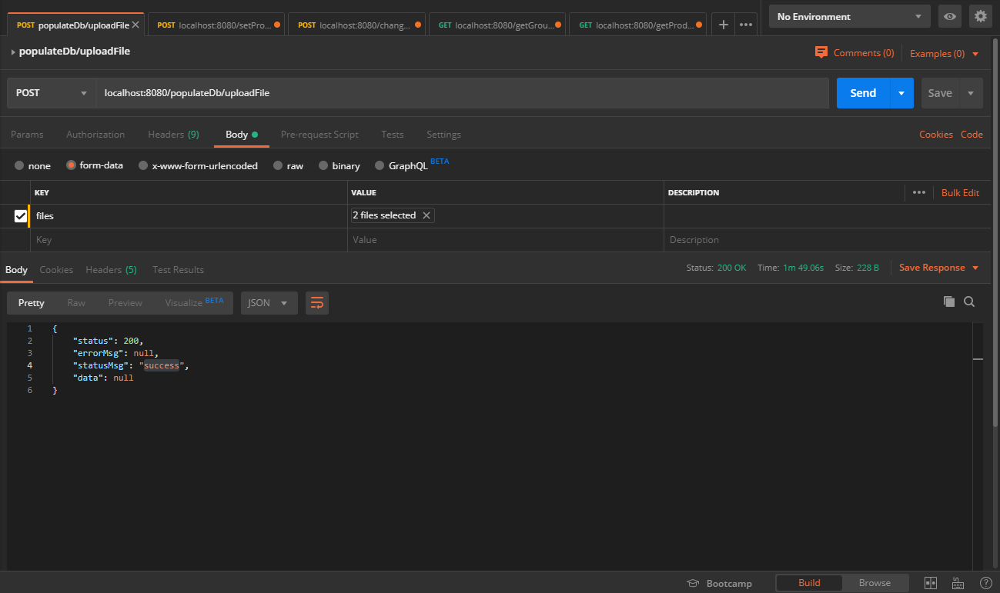
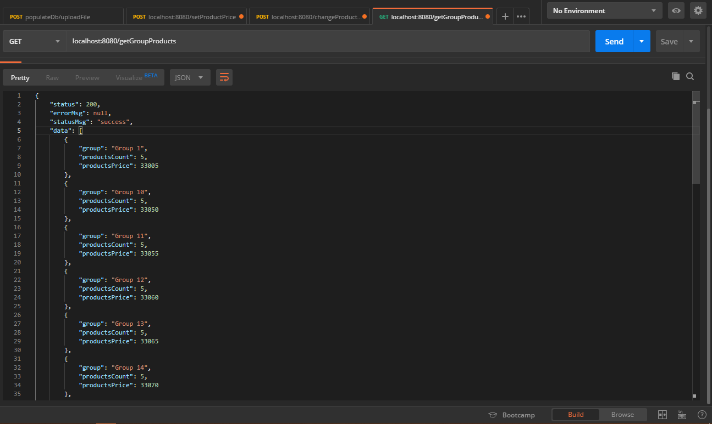

# MyDukan
Spring Boot backend web framework.

## Populating Database
To populate database call multipartFile API `/populateDb/uploadFile` with csv files in resource directory. This api populates data to mySQL local instance warehouse db. Creates two tables in mySQL with name group_listing and products.

## Application Properties
MySQL properties are listed down in application.properties file, change them according to your MySQL instance.
Multipart form data upload directory is specified in the application.properties file, change them according to your system folder structure.

## APIS

| API                            | Description                                                                |
| ------------------------------ | -------------------------------------------------------------------------- |
| `/populateDb/uploadFile`       | Populates data in warehouse Db.                                            |
| `/setProductPrice`             | Sets Products Price                                                        |
| `/addProduct`                  | Adds new Product.                                                          |
| `/changeProductGroup`          | Changes product's group.                                                   |
| `/getGroupProducts`            | Fetches count and sum of prices of all products associated with each Group |

## Screen Shots

| Populate Db Api                                | Get Group Products API                         |
| ---------------------------------------------- | ---------------------------------------------- |
|         |          |
